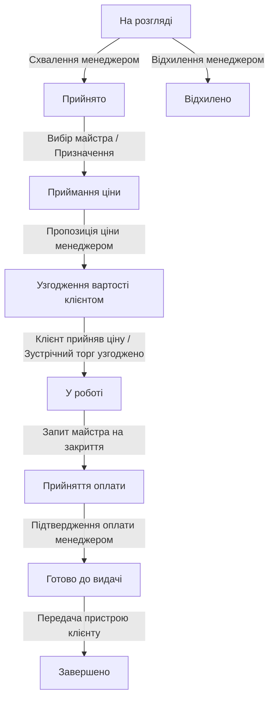

# 🛠️ TechFix (ServiceDesk Plus) — Cyberpunk Service Desk System

**TechFix** — це сучасна, преміальна повнофункціональна система управління сервісним центром (Service Desk) з унікальним дизайном у стилі Cyberpunk. Система спроєктована для автоматизації взаємодії між клієнтами, майстрами та менеджерами сервісного центру з повною синхронізацією через Telegram-бот та інтеграцією штучного інтелекту (AI).

---

## 🚀 Основні можливості системи

### 1. Рольова модель та безпека
- **Клієнт (Client):** створює заявки на ремонт, відстежує їх статус, веде публічний діалог з менеджером, пропонує зустрічну ціну (торгується) за допомогою ШІ, позначає оплату та підтверджує отримання пристрою (handover).
- **Майстер (Master):** бере вільні заявки в роботу, фіксує виконані роботи та використані запчастини, залишає внутрішні замітки та звітує менеджеру.
- **Менеджер (Manager):** керує життєвим циклом заявок, призначає майстрів, узгоджує ціни з клієнтом, підтверджує отримання оплати, контролює приватний чат з майстрами та веде публічний чат з клієнтами.
- **Адміністратор (Admin):** має повний доступ до аналітики, статистики замовлень та керування ролями користувачів сайту.

### 2. Роздільні чати (Dual Chat Rooms)
- **Публічний чат (Client ↔ Manager):** доступний для клієнта та всього персоналу. Тут ведеться офіційне обговорення ремонту та вартості.
- **Приватний чат (Master ↔ Manager):** доступний виключно для персоналу (майстра, менеджера, адміна). Клієнт фізично не отримує доступ до цих повідомлень через суворе розділення на рівні API бази даних (`is_private: true`).

### 3. Штучний Інтелект (AI Integration via OpenRouter)
- **Офіційний тон від ШІ:** менеджер або майстер може в один клік перетворити свій звичайний коментар на ввічливе, професійне ділове повідомлення.
- **Розумний торг для клієнта (AI Bargaining):** клієнт може автоматично згенерувати аргументовану та ввічливу пропозицію зниження ціни на основі свого початкового коментаря.

### 4. Автоматизований Telegram-бот
- Синхронізований з базою даних сервісного центру (на базі `Aiogram 3`).
- Надає оперативні сповіщення про створення заявок, зміну статусів, призначення майстрів та нові коментарі.
- Підтримує швидкий перегляд профілю (`/me`), списку активних заявок (`/requests`) та детальної інформації про заявку (`/status {id}`) з автоматичним очищенням HTML/Markdown тегів для стабільної роботи без збоїв.
- Захищений механізм прив'язки акаунту (binding guard), що унеможливлює повторну прив'язку чи дублювання профілів.

### 5. Гарантійний талон та Звіти
- Автоматична генерація гарантійного талона після успішної оплати.
- Фіксація точного часу прийому пристрою, часу видачі, переліку робіт та вартості в талоні.

---

## 📂 Структура проєкту

```
ServiceDesk_plus/
├── main.py                  # Backend: FastAPI додаток, API ендпоінти, AI логіка
├── project_models.py        # База даних: Опис моделей SQLAlchemy (Async)
├── tg_bot.py                # Telegram Bot: Aiogram 3 логіка та обробники команд
├── database.db              # SQLite база даних
├── .env                     # Файл конфігурації середовища
├── vite.config.js           # Конфігурація збирача Vite
├── src/                     # Frontend: React додаток
│   ├── main.jsx             # Точка входу React
│   ├── App.jsx              # Налаштування маршрутизації (React Router v6)
│   ├── api/
│   │   └── client.js        # API Клієнт (Axios) для взаємодії з FastAPI
│   ├── components/
│   │   ├── ui/
│   │   │   └── index.jsx    # Дизайн-система (Cyberpunk Styled Components)
│   │   ├── Navbar.jsx       # Адаптивна навігаційна панель
│   │   └── ProtectedRoute.jsx # Захист роутів на основі авторизації/ролей
│   ├── styles/
│   │   ├── theme.js         # Кольорові токени HSL та шрифти
│   │   └── GlobalStyle.js   # Глобальні Cyberpunk стилі (скан-лінії, неон, сітка)
│   └── pages/               # Сторінки додатку (MyRequestsPage, AdminProblemPage, etc.)
└── dist/                    # Результат збірки фронтенду
```

---

## 🛠️ Налаштування оточення

Створіть файл `.env` у кореневій директорії проєкту та заповніть його за цим зразком:

```ini
DATABASE_URL=sqlite+aiosqlite:///./database.db
BOT_TOKEN=ВАШ_TELEGRAM_BOT_TOKEN
SECRET_KEY=ВАШ_СУПЕР_СЕКРЕТНИЙ_КЛЮЧ_ДЛЯ_JWT
OPENROUTER_API_KEY=ВАШ_OPENROUTER_API_KEY
OPENROUTER_MODEL=openrouter/owl-alpha
```

---

## ⚙️ Встановлення та запуск

### Крок 1. Підготовка бекенду (FastAPI + Telegram Bot)

1. Переконайтеся, що у вас встановлено Python 3.10+.
2. Створіть віртуальне середовище та активуйте його:
   ```bash
   python -m venv .venv
   source .venv/bin/activate  # На Linux/macOS
   # або
   .venv\Scripts\activate     # На Windows
   ```
3. Встановіть необхідні залежності:
   ```bash
   pip install fastapi uvicorn sqlalchemy aiosqlite pydantic python-dotenv python-multipart PyJWT passlib[bcrypt] aiogram httpx jinja2
   ```
4. Запустіть FastAPI бекенд-сервер:
   ```bash
   uvicorn main:app --reload --port 8000
   ```
   *Бекенд буде доступний за адресою: `http://localhost:8000`. Автоматична документація Swagger: `http://localhost:8000/docs`.*

5. Запустіть Telegram-бот (в окремому терміналі):
   ```bash
   python tg_bot.py
   ```

### Крок 2. Підготовка фронтенду (Vite + React)

1. Перейдіть до кореневої директорії проєкту.
2. Встановіть npm-залежності:
   ```bash
   npm install
   ```
3. Запустіть сервер розробки фронтенду:
   ```bash
   npm run dev
   ```
   *Фронтенд буде доступний за адресою: `http://localhost:5173`.*

---

## 📈 Схема життєвого циклу заявки



---

## 🎨 Особливості дизайну (Cyberpunk Theme)
- **Кольори:** Тонкі налаштування HSL, глибокий темний фон (`#030a1c`), яскраві неонові акценти (Cyan `#00e5ff`, Green `#00ff9d`, Red `#ff3b5c`).
- **Ефекти:** М'яке світіння (text-shadow, box-shadow), футуристичні скошені куточки панелей (`PanelCorners`), анімовані скан-лінії (Scanlines) та ефект CRT-монітора.
- **Шрифти:** Використання Google Fonts: `Share Tech Mono` для акцентів і кодів, та `Outfit` для зручного інтерфейсу користувача.

## 🔒 Безпека бази даних та міграції
- При запуску FastAPI додатка автоматично виконується перевірка структури бази даних.
- Скрипти самовідновлення (self-healing auto-upgrade) автоматично створюють нові таблиці та додають відсутні колонки (наприклад, `is_private` для `AdminResponse`), забезпечуючи плавний перехід без втрати даних.
